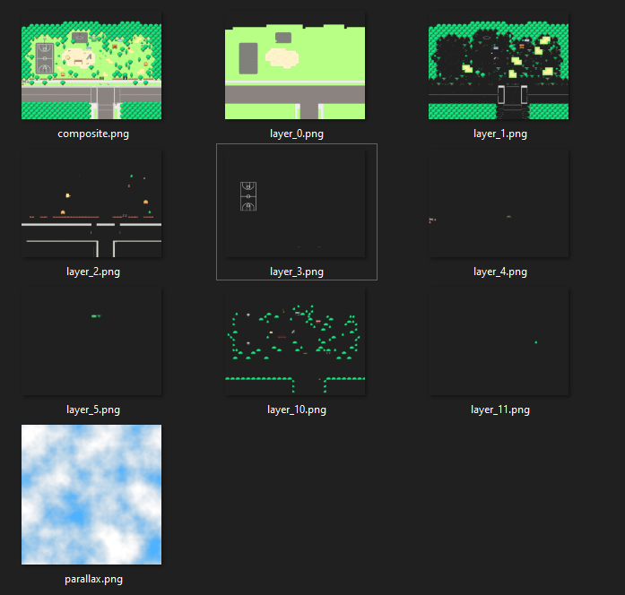
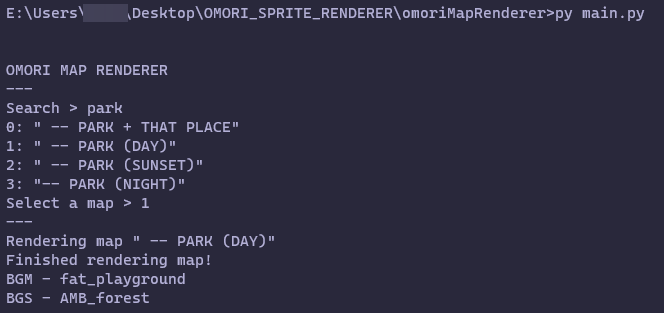

# OMORI Map Renderer
⚠ **WARNING: this project is not maintained.** ⚠ 
running `main.py` after setup lets you search for and render a map into multiple layers, while also giving BGM/BGS info. 
i wrote this program mainly to speed up the process of making [wallpapers for wallpaper engine](https://steamcommunity.com/sharedfiles/filedetails/?id=2395161461)! it wasn't really meant to be released, so forgive me if this is super unreadable.
## setup
[get python](https://www.python.org/downloads/) (i'm using 3.8.5, 3.9 should? work fine) 
`pip install -r requirements.txt` for initial setup 
download and install [GOMORI](https://github.com/Gilbert142/gomori/releases), install the [decryptor mod](https://cdn.discordapp.com/attachments/794907202346942535/795093929536126986/decryptor.zip) and run the game 
go into `base_config.json` and change `"www": "[path to www_decrypt]"` to match where your www_decrypt folder is, i.e. `"www": "C:\\Program Files (x86)\\Steam\\steamapps\\common\\OMORI\\www_decrypt"` 
__rename `base_config.json` to `config.json`__ 
open a new cmd or terminal instance, run `py main.py`
## examples
example output 
 
command line interface 

i might make something in the future to make this easier to use in the future but i'm putting it on here as it is currently!
